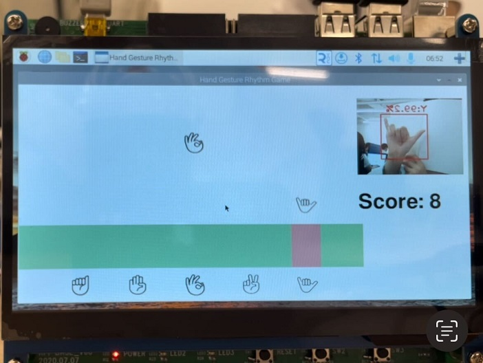
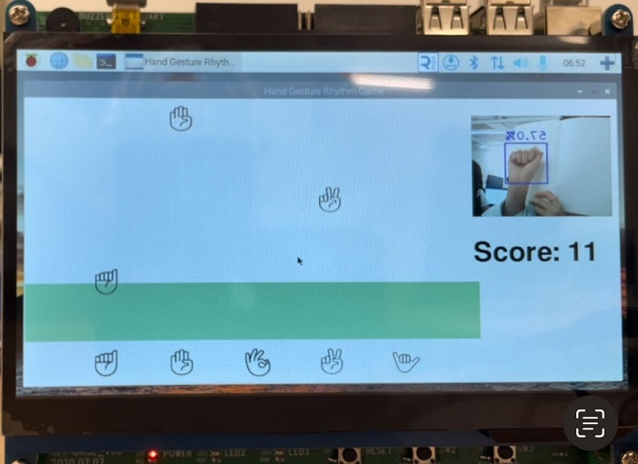

# hand_gesture_rain_game
## 실행방법
hand_gesture_rain_game 폴더 안에 main.py를 실행합니다.

    python3 main.py

## 게임 시작
화면에 나오는 Start 버튼을 누릅니다.

## 게임 재시작
게임이 종료 되면 Retry 버튼을 눌러 재시작할 수 있습니다.

## 게임 방법
화면 위에서 내려오는 손 동작을 따라합니다.  
초록색 영역에 아이콘이 내려오고 손동작이 맞으면 점수를 얻습니다.  
놓친 아이콘이 있으면 -1점이 됩니다.

## 모델 학습
Training 폴더 안에 collab에서 사용한 학습 코드가 있습니다.

## 게임 시연 화면

 
